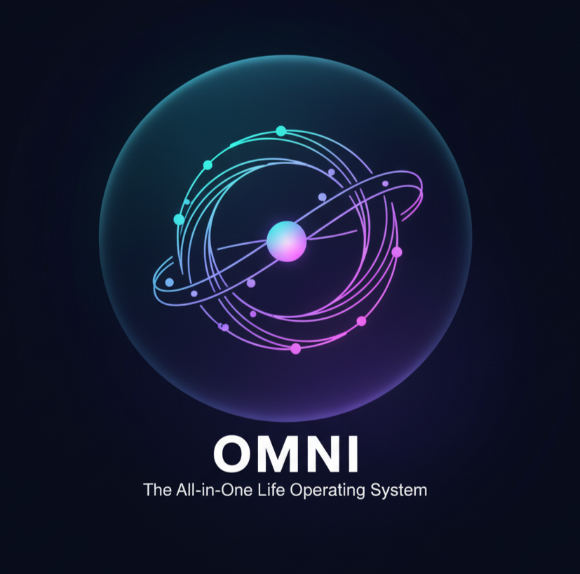
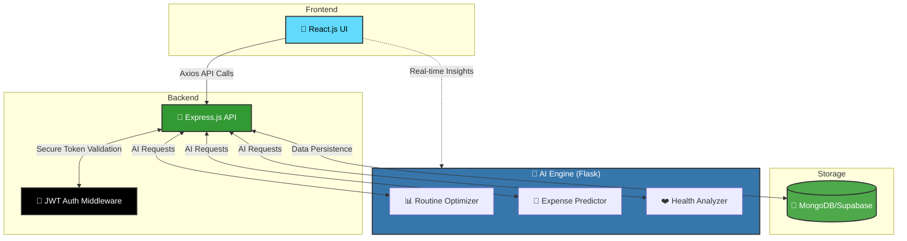

<div align="center">



# 🧠 OMNI
### *The All-in-One Life Operating System*

[](https://reactjs.org/)
[](https://nodejs.org/)
[](https://expressjs.com/)
[](https://www.mongodb.com/)
[](https://www.python.org/)
[](https://jwt.io/)

**Your life. Unified. Intelligent. Effortless.**

*OMNI is an AI-powered personal dashboard that unifies your daily life  tasks, goals, health, and finances  into one smart and adaptive system.*

[🚀 Get Started](#-quick-start) • [✨ Features](#-core-features) • [📖 Documentation](#-setup-instructions) • [👥 Team](#-meet-the-team)

---

</div>

## 🎯 Mission Statement

> *To empower individuals with one intelligent system that understands how they live  and helps them live better.*

OMNI transforms how you organize your life  combining productivity, wellness, and financial insights into one intelligent, secure ecosystem. It learns your habits, helps you plan better, and ensures privacy through JWT-based authentication.

---

## ✨ Core Features

<table>
<tr>
<td width="50%">

### 🧭 Unified Dashboard
Consolidate tasks, goals, meals, and finances into one intelligent interface.

### 🔐 JWT Authentication
Bank-grade security with token-based user sessions.

### 🤖 AI Routine Optimizer
Smart suggestions for focus blocks and rest intervals based on your patterns.

</td>
<td width="50%">

### 💰 Expense Predictor
AI-powered detection of overspending patterns and budget insights.

### 💪 Health Pulse
Track daily habits, physical activity, and wellness metrics.

### 🧘 Daily Brief
Voice and text summaries of your day, priorities, and achievements.

</td>
</tr>
</table>

### 📱 **Responsive Design**  Seamlessly works across web and mobile devices

---

## 🏗️ System Architecture



---

## 🚀 Quick Start

Get OMNI running locally in minutes:

```bash
# 1️⃣ Clone the repository
git clone https://github.com/SeifEddineMezned/omni.git

# 2️⃣ Navigate into the project
cd omni

# 3️⃣ Install dependencies
npm install

# 4️⃣ Configure environment variables
# Create a .env file with:
# MONGO_URI=your_mongodb_connection_string
# JWT_SECRET=your_secret_key_here

# 5️⃣ Launch the application
npm start
```

🌐 Open [http://localhost:3000](http://localhost:3000) in your browser and start organizing your life!

> ⚠️ **Note:** `node_modules` is excluded via `.gitignore`  always run `npm install` after cloning.

---

## 🛠️ Technology Stack

<div align="center">

| Layer | Technology | Purpose |
|:-----:|:-----------|:--------|
| **Frontend** | React.js | Modern, component-based UI framework |
| **Routing** | React Router DOM | Seamless page navigation |
| **API Client** | Axios | Efficient HTTP communication |
| **Backend** | Node.js + Express.js | RESTful API server |
| **Authentication** | JWT | Secure, stateless user sessions |
| **AI Engine** | Flask (Python) | Machine learning microservice |
| **Database** | MongoDB / Supabase | Scalable data storage |
| **Version Control** | GitHub | Collaboration and CI/CD |

</div>

---

## 📁 Project Structure

```
omni/
│
├── 📂 src/
│   ├── 🎨 assets/          # Logos, images, and static files
│   ├── 🧩 components/      # Reusable React components
│   ├── 📄 pages/           # Application views (Dashboard, Settings, etc.)
│   ├── 🔧 services/        # API integration & JWT helpers
│   ├── App.js              # Root React component
│   ├── App.css             # Global styling
│   └── index.js            # Application entry point
│
├── 📦 package.json         # Dependencies and scripts
├── 🔒 .env.example         # Environment variables template
└── 📖 README.md            # You are here!
```

---

## 👥 Meet the Team

<div align="center">

**Built with passion by:**

| Seif Eddine Mezned | Brahim Amous | Mohamed Barrak | Hiba Allah Msallem |
|:------------------:|:------------:|:--------------:|:------------------:|


*MedTech University CS 324 Web Development Project*

</div>

---

## 🌟 Why OMNI?

<table>
<tr>
<td align="center" width="25%">
<h3>🎯</h3>
<strong>All-in-One</strong><br/>
No more app-switching chaos
</td>
<td align="center" width="25%">
<h3>🧠</h3>
<strong>AI-Powered</strong><br/>
Smart insights that adapt to you
</td>
<td align="center" width="25%">
<h3>🔒</h3>
<strong>Secure</strong><br/>
Your data stays private
</td>
<td align="center" width="25%">
<h3>📱</h3>
<strong>Accessible</strong><br/>
Works everywhere, anytime
</td>
</tr>
</table>

---

## 🎨 Visual Showcase

<div align="center">

*"The OMNI interface design and intelligence, unified."*

🖼️ **Screenshots coming soon!**

</div>

---

## 📜 License

```
© 2025 OMNI Team
CS 324 Web Development Project

This project is developed for educational purposes.
```

---

<div align="center">

### 🌟 Star this repo if you find it useful!

**Made with ❤️ and ☕ by the OMNI Team**

[⬆ Back to Top](#-omni)

</div>
